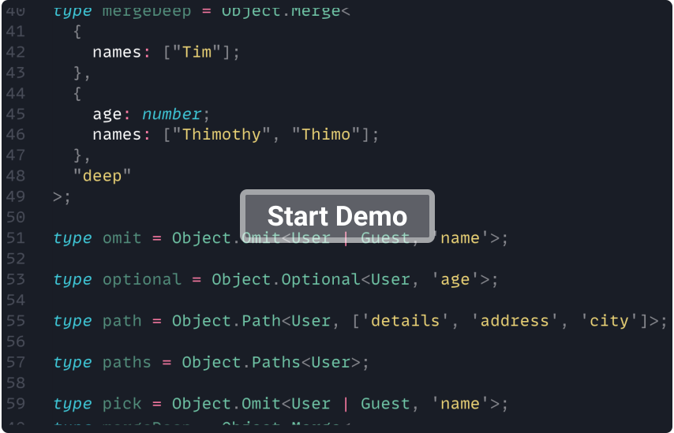

<p align="center">
  <a href="https://github.com/millsp/ts-toolbelt">
    
  </a>
  <h4 align="center">TypeScript's largest utility library</h4>
</p>

<p align="center">
  <a href="https://www.npmjs.com/package/ts-toolbelt" >
    
  </a>
  <a href="https://travis-ci.org/millsp/ts-toolbelt" >
    
  </a>
  <a href="#">
    
  </a>
  <a href="https://lgtm.com/projects/g/millsp/ts-toolbelt/context:javascript">
    
  </a>
  <a href="#">
    
  </a>
</p>

<p align="center">
  <a href="https://gitter.im/ts-toolbelt/community?utm_source=share-link&utm_medium=link&utm_campaign=share-link" >
    
  </a>
  <a href="http://makeapullrequest.com" >
    
  </a>
  <a href="https://conventionalcommits.org" >
    
  </a>
  <a href="https://github.com/millsp/ts-toolbelt/blob/master/CODE_OF_CONDUCT.md" >
    
  </a>
  <a href="#">
    
  </a>
</p>

<p align="center">
  <a href="https://millsp.github.io/ts-toolbelt/">📖 Documentation</a>
  ·
  <a href="https://github.com/millsp/ts-toolbelt/issues?utf8=✓&q=is%3Aissue+label%3Aannouncement+sort%3Acreated-desc+">📣 Announcements</a>
  ·
  <a href="https://github.com/millsp/ts-toolbelt/issues/new?template=---bug-report.md" alt="Bug Report">🐞 Report Bug</a>
  ·
  <a href="https://github.com/millsp/ts-toolbelt/issues/new?template=---feature-request.md" alt="Request Feature">🍩 Request Feature</a>
  ·
  <a href="https://github.com/millsp/ts-toolbelt/issues/new?template=---question.md" alt="Ask Questions">🤔 Ask Questions</a>
</p>

## About

**ts-toolbelt** ships **utility types** that provide simple ways to **update**, **change**, and **compute** TypeScript types.
It offers unique dynamic features, allowing you to write type-safe software more **easily** and in **less time** than you do today.

Its programmatic API brings **new capabilities** to TypeScript with **+200** tested type utilities. This makes it the largest and the most reliable type collection out there.
It uses the type system itself for TypeScript to compute complex types. So its API exposes types that trade **CPU & RAM** for higher type safety.

<p align="center">
  <a href="https://codesandbox.io/s/ts-toolbelt-x4jly?file=/src/index.ts">
    
  </a>
</p>

### Goals

* Answer the question to **"How can I do this in TypeScript?"**
* Provide a programmatic **standard API** for the type system
* Promote type **evolution**/**reusability** within your codebase
* Software that is more **type-safe**, **flexible**, and **robust**
* Bring a whole new set of extra **features** to TypeScript
* Extensively tested type utilities for maximum type safety
* This package aims to be the home of all **utility types**
* [Answer questions about types and share knowledge](#good-to-know-)

You'll find all the types you can ever need in this single and **well organized** package.
## Getting Started

### Prerequisites

Lowest TypeScript [support](#compatibility) starts at v3.5

```sh
npm install typescript@^3.8.0 --save-dev
```

For best results, add this to your `tsconfig.json`

```ts
{
  "compilerOptions": {
    // highly recommended (required by few utilities)
    "strictNullChecks": true,

    // this is optional, but enable whenever possible
    "strict": true,
  }
}
```

### Installation

```sh
npm install ts-toolbelt --save
```

### Hello World

```ts
import {Object} from "ts-toolbelt"
// Check the docs below for more

// Merge two `object` together
type merge = Object.Merge<{name: string}, {age?: number}>
// {name: string, age?: number}

// Make a field of an `object` optional
type optional = Object.Optional<{id: number, name: string}, "name"}>
// {id: number, name?: string}
```

> **`TIP`** You can also grab the demo [over here](https://gist.github.com/millsp/f7f7d18773f79bf0618fb5cd55bd48f8).

You can [**level-up, and re-code this library from scratch**](https://medium.com/free-code-camp/typescript-curry-ramda-types-f747e99744ab).

## [Documentation ⤢](https://millsp.github.io/ts-toolbelt/)

### Imports

The project is organized around TypeScript's main concepts:

|            |             |                  |              |               |          |
|------------|-------------|------------------|--------------|---------------|----------|
| **A**ny    | **B**oolean | **C**lass        | **F**unction | **I**teration | **L**ist |
| **N**umber | **O**bject  | **O**bject.**P** | **S**tring   | **U**nion     | Test     |

> **`TIP`** How to choose categories? Match your type with them.

There are many ways to import the types into your project:

* **Explicit**
  ```ts
  import {Any, Boolean, Class, Function, Iteration, List, Number, Object, String, Union} from "ts-toolbelt"
  ```

* **Compact**
  ```ts
  import {A, B, C, F, I, L, N, O, S, U} from "ts-toolbelt"
  ```

* **Portable**
  ```ts
  import tb from "ts-toolbelt"
  ```

You can also import our non-official API from the community:
  ```ts
  import {Community} from "ts-toolbelt"
  ```

> **`TIP`** The community API is for our community to publish useful types that don't see fit in the standard API.

### Internal Docs

If you're interested to **learn** how the internals work, [this tutorial](https://medium.com/free-code-camp/typescript-curry-ramda-types-f747e99744ab) will get you on track to start writing your own types.

### [Archives ⤢](https://github.com/millsp/ts-toolbelt/tree/gh-pages)

Access older docs at https://millsp.github.io/ts-toolbelt/version/

> **`EXAMPLE`** https://millsp.github.io/ts-toolbelt/4.2.1/

## [Good to Know ⤢](https://github.com/millsp/ts-toolbelt/discussions/q-a)

In this wiki, you will find some extra resources for your learning, and understanding.

**Are you missing something?** Participate to the open-wiki by [posting your questions](https://github.com/millsp/ts-toolbelt/discussions/new).

## Running tests

### For this project

To run the `lint` & `type` tests, simply run:

```sh
npm test
```

### For your project

Want to test your own types? Let's get started:

```ts
import {Number, Test} from "ts-toolbelt"

const {checks, check} = Test

checks([
    check<Number.Plus<"1", "30">, "31", Test.Pass>(),
    check<Number.Plus<"5", "-3">, "2",  Test.Pass>(),
])
```

> **`TIP`** Place it in a file that won't be executed, it's just for TypeScript to test types.

### Continuous Integration

The releases are done with Travis CI in stages & whenever a branch or PR is pushed:

- Tests are run with `npm test`
- Tests against [DefinitelyTyped](https://github.com/DefinitelyTyped/DefinitelyTyped/)
- Releases to npm@[branch-name]

If you wrote tests & would like your project to be tested too, please open an issue.

## Compatibility

The project is maintained to adapt to the constant [changes of TypeScript](https://github.com/Microsoft/TypeScript/wiki/Roadmap):

| ts-toolbelt | typescript |
|-------------|------------|
| 8.x.x       | ^4.0.x     |
| 6.x.x       | ^3.7.x     |
| 4.x.x       | ^3.5.x     |
| 2.x.x       | ^3.5.x     |
| 3.x.x       | ^3.5.x     |
| 1.x.x       | ~3.5.x     |

Major version numbers will upgrade whenever TypeScript had breaking changes. 
Otherwise, the release versions will naturally follow the semantic versioning.

## What's next

* Automated performance tests
  ```sh
  # performance is checked manually with 
  npx tsc --noEmit --extendedDiagnostics
  ```

* Need to write more examples

## Related Projects

* [`eledoc`](https://github.com/millsp/eledoc) - 🌒 A material dark theme for TypeDoc 
* [`utility-types`](https://github.com/piotrwitek/utility-types) - Collection of utility types, complementing TypeScript built-in mapped types and aliases

## License

[](https://app.fossa.com/projects/git%2Bgithub.com%2Fpirix-gh%2Fts-toolbelt?ref=badge_large)
